 

**\[[🇧🇷 Português](README.pt_BR.md)\] \[**[🇺🇸 English](README.md)**\]**

  

#  
 2- 🧠 [Machine Learning]() / [EMNIST Vision Intelligence Project]()
### 
 Deep Learning Pipeline for Handwritten Character Recognition with PyTorch and Streamlit

  
<!-- ========= END REPO TITLE ========= -->

  

<!-- ========= START Dashboard Streamlit ========= -->

  

<!-- ========= END Dashboard Streamlit ========= -->

<!-- ========= START Canva Slides ========= -->

  
  
<!-- =========End Canva Slides ========= -->

<!-- ========= START DATA ANALYSING REPORT ========= -->
  

    
<!-- ========= END DATA ANALYSING REPORT ========= -->

<!-- ======================================= Start nstitucional INFO ===========================================  -->
[**Institution:**]() Pontifical Catholic University of São Paulo (PUC-SP  Humanistic AI & Data Science • 5º Semestre • 2026  
[**School:**]() Faculty of Interdisciplinary Studies   
[Course Repo:]() INTEGRATED PROJECT: MACHINE LEARNING   
**Professor:**  [✨ Rooney Ribeiro Albuquerque Coelho](https://www.linkedin.com/in/rooney-coelho-320857182/)   
**Authors**:**  [Fabiana ⚡️ Campanari](https://linktr.ee/fabianacampanari) e [Perdro Vyctor Almeida]()      

  
<!-- ========= END Institucional INFO ========= -->

<!-- ========= START SPONSORT BADGE ========= -->
#### 
 

   
<!-- ========= END SPONSORTBADGE ========= -->

<!-- =========  START PUC HEADER GIF ========= -->

   
 

    
<!-- =========  END PUC HEADER GIF ========= -->

<!-- ========= START BADGES GROUP 2 ========= -->

  

  
  

  
  
  

   
<!-- ========= END BADGES GROUP 2 ========= -->

<!-- ========= START NOTE ========= -->
> [!NOTE]
>
> ⚠️ Projects may be publicly shared when permitted.  
> The focus is on applied, hands-on learning with real datasets in AI governance and security contexts.  
> All sensitive content remains protected in private repositories when required.
>

  
<!-- ========= END NOTE ========= -->

<!-- ========= START OVERVIEW ========= -->

<!--   

#

   -->
<!-- ========= END Overview ========= -->

<!-- ========= START Main Repo REFERENCE  ========= -->
> [!TIP]
>
> This repository is part of the flagship ecosystem:
>
> ## 🧠 AI & Machine Learning — Main Hub
>
> Explore the complete collection of projects, notebooks, research materials, analyses, and interactive applications available in the central repository:
>
> 🔗 **[AI & Machine Learning — Hub](https://github.com/Mindful-AI-Assistants/1-AI_Machine-Learning_Hub)**
>
> #
>
> ✨ Part of the *Humanistic AI & Data Modeling Series*
> 
> *Teaching machines to recognize patterns while developers learn patience debugging the exceptions.* 

    
<!-- ========= END Main Repo REFERENCE  ========= -->
<!-- ======================================= END DEFAULT HEADER ⚡️ ===========================================  -->

## Table of Contents

🚧 Project Under Construction 🚧

  

## MLOps Pipeline Architecture

```mermaid
%%{init: {
  "theme": "base",
  "themeVariables": {
    "background": "#020617",
    "primaryColor": "#020617",
    "primaryBorderColor": "#2dd4bf",
    "primaryTextColor": "#ffffff",
    "lineColor": "#2dd4bf",
    "secondaryColor": "#020617",
    "tertiaryColor": "#020617",
    "clusterBkg": "#020617",
    "clusterBorder": "#2dd4bf",
    "fontFamily": "Inter, monospace",
    "fontSize": "16px"
  }
}}%%

flowchart TB

%% =========================
%% STYLE
%% =========================
classDef clean fill:#020617,stroke:#2dd4bf,color:#ffffff,stroke-width:1px;

%% =========================
%% PIPELINE
%% =========================

A["EMNIST Balanced Dataset"]:::clean

B["Handwritten Character Samples"]:::clean

C["Image Preprocessing"]:::clean

D["Grayscale Conversion"]:::clean

E["Resize to 28×28"]:::clean

F["Tensor Transformation"]:::clean

G["Python AI Pipeline"]:::clean

H["PyTorch Deep Learning Model"]:::clean

I["Perceptron Layers"]:::clean

J["Convolutional Neural Networks"]:::clean

K["Dropout Regularization"]:::clean

L["Backpropagation & Optimization"]:::clean

M["TensorBoard Monitoring"]:::clean

N["Accuracy & Loss Evaluation"]:::clean

O["OpenCV Real-Time Processing"]:::clean

P["Character Prediction Engine"]:::clean

Q["Softmax Probability Output"]:::clean

R["Streamlit Interactive Dashboard"]:::clean

S["Drawing Canvas Interface"]:::clean

T["Final AI Inference"]:::clean

%% =========================
%% FLOW
%% =========================

A --> B
B --> C
C --> D
D --> E
E --> F
F --> G

G --> H
H --> I
I --> J
J --> K
K --> L

L --> M
M --> N

N --> O
O --> P
P --> Q

Q --> R
R --> S
S --> T

linkStyle default stroke:#2dd4bf,stroke-width:1px;
```

  

  
  
  
  
  
  
  
  
  

<!-- ======================================= Start DEFAULT Footer ===========================================  -->

  

## 💌 [Let the data flow... Ping Me !](mailto:fabicampanari@proton.me)

 

#### 
  🛸๋ My Contacts [Hub](https://linktr.ee/fabianacampanari)

 

### 
 

  

  ────────────── ⊹🔭๋ ──────────────

<!--

  ────────────── 🛸๋*ੈ✩* 🔭*ੈ₊ ──────────────
-->

 

 ➣➢➤ <a href="#top">Back to Top </a>
  

  
#
 
##### 
Copyright 2026 Mindful-AI-Assistants. Code released under the  [MIT license.](https://github.com/Mindful-AI-Assistants/CDIA-Entrepreneurship-Soft-Skills-PUC-SP/blob/21961c2693169d461c6e05900e3d25e28a292297/LICENSE)

<!-- ======================================= End  DEFAULT Footer ===========================================  -->

